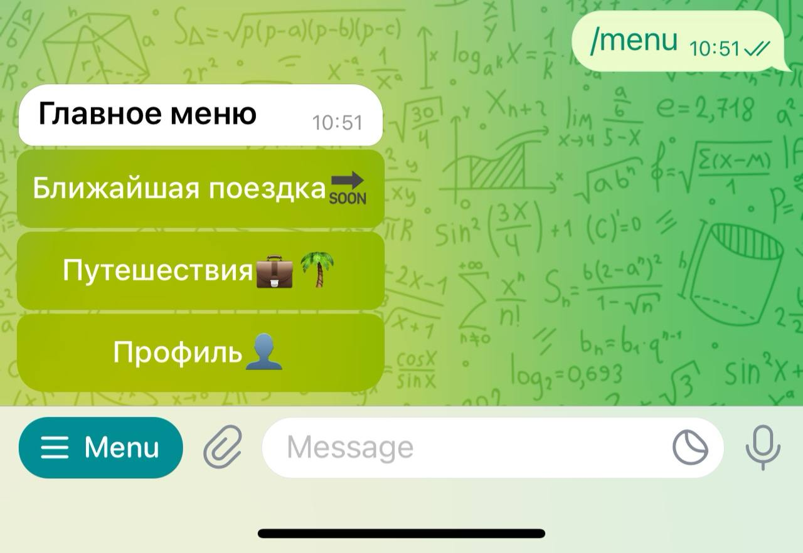
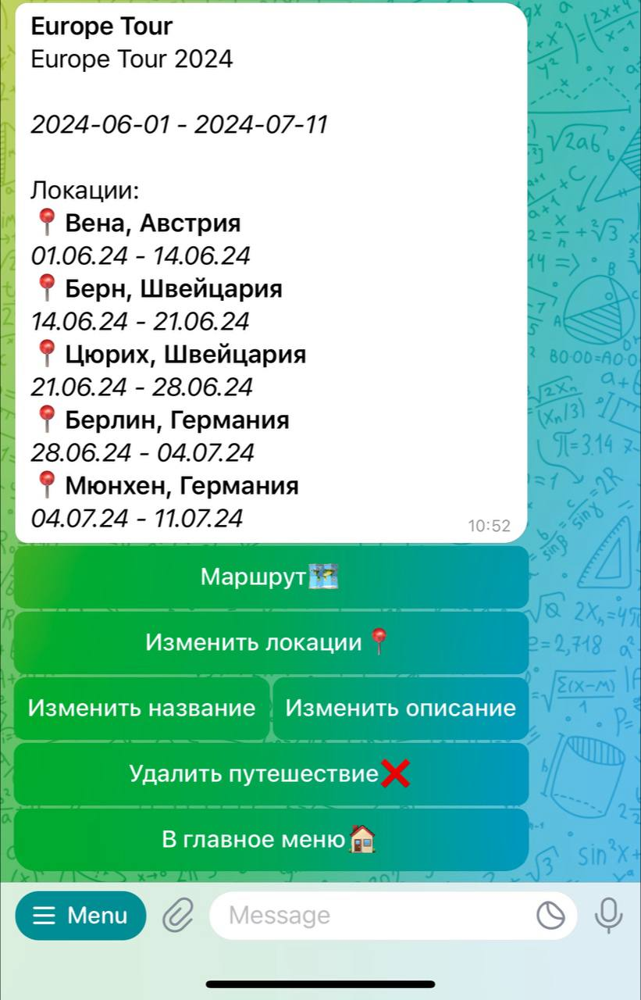
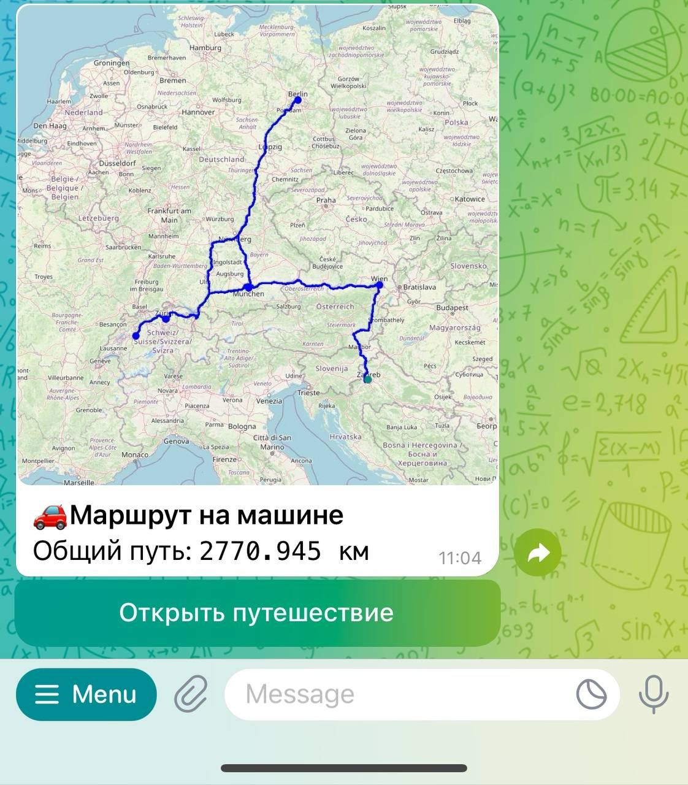

# Travel Agent 3.0

### Ссылка на бота: [@tragent_bot](https://t.me/tragent_bot)
Бот, который будет помогать вам управлять вашими путешествиями и строить маршруты
# Инструкция по запуску
## Запуск с помощью docker compose
### Склонируйте репозиторий

`gh repo clone Central-University-IT-prod/backend-artem41k`

(пример с использованием Github CLI)

### Перейдите в директорию проекта

`cd backend-artem41k`

### Введите команду

`docker compose up -d`

## Описание docker-compose.yml

В docker-compose.yml есть 3 сервиса:

### backend

Основной backend бота, управляет пользователями, путешествиями и т.д.

### postgres

База данных PostgreSQL, используемая бэкендом

### tg-bot

Сам Telegram бот

Благодаря docker compose, все эти контейнеры находятся в одной сети, и Telegram бот общается с бэкендом, а бэкенд - с базой данных

# Демонстрация работы

# Стек и внешние интеграции

## Бэкенд

Для написания бэкенда был выбран язык программирования **Python** с использованием фреймворка **Django** (+ REST Framework), чтобы в дальнейшем можно было разработать полноценный фронтенд или мобильное приложение, помимо Telegram бота

### База данных

Базой данных была выбрана PostgreSQL, т.к. она очень популярна и поднимается в docker’е

## Telegram бот

Написан тоже на Python, с использованием библиотеки aiogram, по причине её широкого функционала и асинхронности

## Использованные API

### Геокодинг и обратный геокодинг

Для этих функций используется OpenStreetMap API (а именно Nominatim) с помощью библиотеки для Python [OSMPythonTools](https://github.com/mocnik-science/osm-python-tools)

### Маршруты

Для построения маршрутов используется OpenRouteService API, потому что у него широкий функционал и неплохие лимиты для бесплатного плана)

Для работы с этим API используется библиотека [routingpy](https://github.com/gis-ops/routingpy)

# Дополнительно
Для авторизации пользователя без пароля (по Telegram id) был реализован свой класс аутентификации, использующий header 'Authentication' в который при вызове API из бота передаётся Telegram id пользователя, подписанный секретным ключом (`DJANGO_SECRET_KEY`)

# Схема данных СУБД

## Модель User
### Поля
- `id`
- `first_name`
- `last_name`
- `tg_id`
- `age`
- `bio`
### Поля созданные Django (на будущее)
- `password`
- `last_login`
- `is_superuser`
- `email`
- `is_staff`
- `is_active`
- `date_joined`

## Модель Trip
### Поля
- `name`
- `description`
- `owner` (One to many to `User`)
- `participants` (Many to many to `User`)

## Модель Location
### Поля
- `city`
- `country`
- `lat`
- `lon`
- `data` (Nominatim data)
### Дочерние модели, реализующие доп. поля
**UserLocation**
- user (One to one to `User`)

**TripLocation**
- `start_date`
- `end_date`
- `trip` (One to Many to `Trip`)